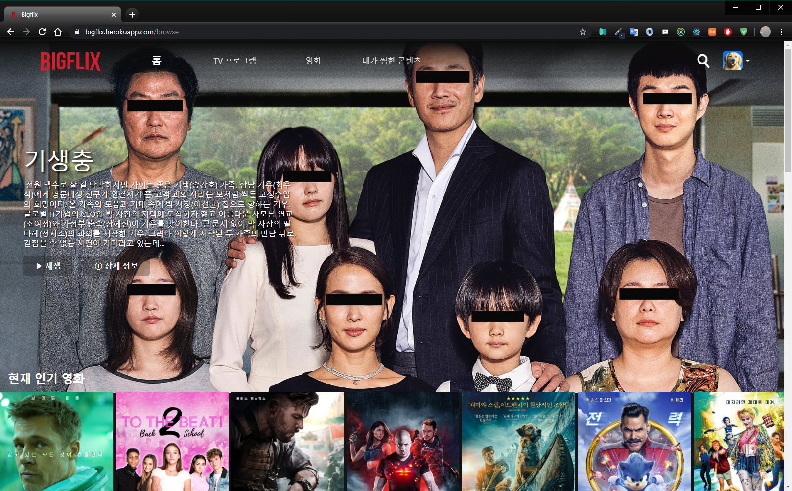
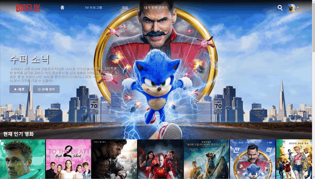
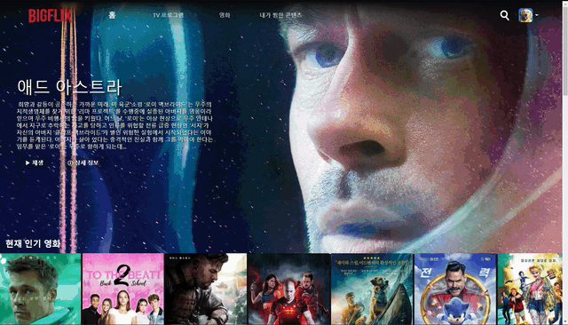
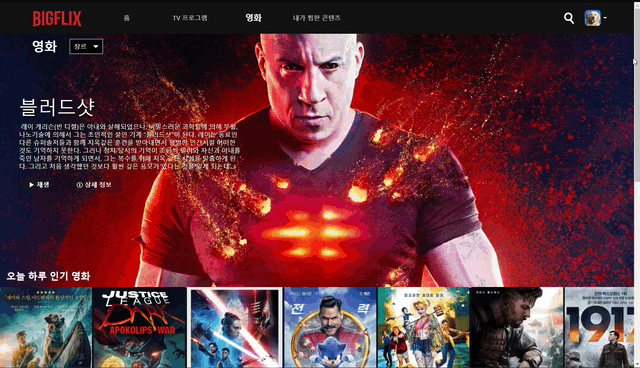
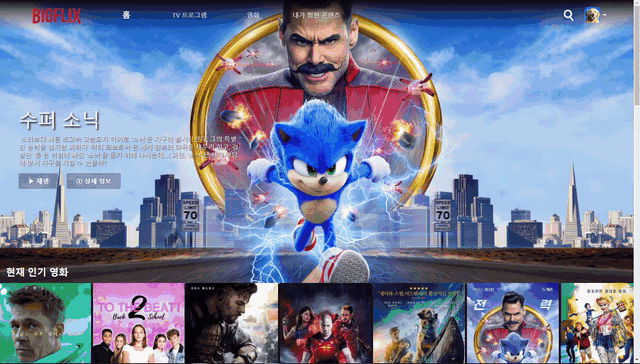
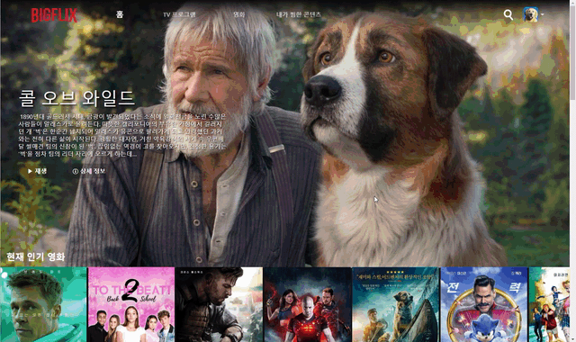

# :movie_camera:넷플릭스 클론(Using react)

## :wave:소개

리액트 Hooks을 통한 영화 모음 사이트(넷플릭스 클론) [by TMDB API]

</img>

<hr/>

## :computer:Live Site

- Link: [Bigflix][bigflixlink]
  - testID: test@gmail.com
  - testPW: test123

[bigflixlink]: https://bigflix.herokuapp.com/

<hr/>

## :mag:주요 Tech

- React Hooks
- React Context API
- Styled Component
- Redux
- ES6
- AXIOS(TMDB API)
- Portal(Modal)

<hr/>

## :floppy_disk:주요 포함 내용

:one: PrivateRoute를 통한 권한 설정

```
export default () => (
<Router>
  <>
    <Switch>
      <Route path="/" exact component={Login} />
      <Route path="/register" component={Register} />
      <PrivateRoute path="/browse" exact component={Home} />
      <PrivateRoute path="/browse/tv" exact component={TV} />
      <PrivateRoute path="/browse/movie" exact component={Movie} />
      <PrivateRoute path="/browse/tv/:genre" component={TV} />
      <PrivateRoute path="/browse/movie/:genre" component={Movie} />
      <PrivateRoute path="/browse/mylist" component={MyList} />
      <PrivateRoute path="/search" component={Search} />
      <Redirect from="*" to="/" />
    </Switch>
    <Footer />
  </>
</Router>
);

```

:two: Search 탭에서 원하는 검색어 타이핑 시, 바로 일치하는 내용화면 출력

</img>

:three: 자신이 원하는 영상 클릭 후 '찜하기' 를 누르면 내가 찜한 콘텐츠에 추가[계정별로 Mylist 설정]

</img>

:four: JavaScript를 통한 페이지 좌우 스크롤 버튼 추가 [Home, TV, Movie, DetailSimilar, DetailSeason]

</img>

:five: TV 프로그램, Movie 에서 각 장르에 따른 API 받아오기 설정

</img>

:six: Header메뉴 반응형 설정

</img>

:seven: UseScroll을 통한 각 페이지에서의 Header 이벤트 설정

</img>

:eight: Portal을 통한 Detail Modal 설정

</img>

:nine: TopSection 화면 랜덤함수를 통해 새로고침될 때 마다 변경

```
const HomePresenter = ({ result, loading, error }) => {
  const [headerImg, setHeaderImg] = useState(); //대표 이미지
  useEffect(() => {
    setHeaderImg(Math.floor(Math.random() * 10)); // popularMovie 10개 랜덤 출력
  }, []);
  return loading ? (
    <Loader />
  ) : (
    <>
      {result && result.popularMovie && result.popularMovie.length > 0 && (
        <TopSection
          result={
            result.popularMovie[headerImg].backdrop_path === null ||
            result.popularMovie[headerImg].overview === ""
              ? result.popularMovie[0]
              : result.popularMovie[headerImg]
          }
          isMovie={true}
        />
      )}
```

<hr/>

## :pushpin:현재 프로젝트에서 추가할 Plan

- [ ] 설정을 통한 (한국어 - 영어) 변환하기
- [ ] 한 계정에 여러 프로필을 설정해 MyList 설정
- [ ] 계정 삭제
- [ ] 무한 스크롤링 구현
